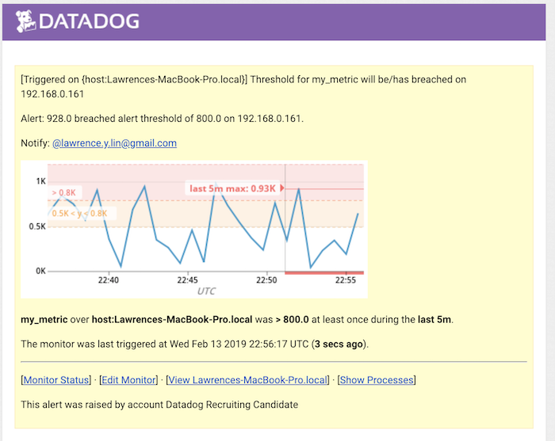
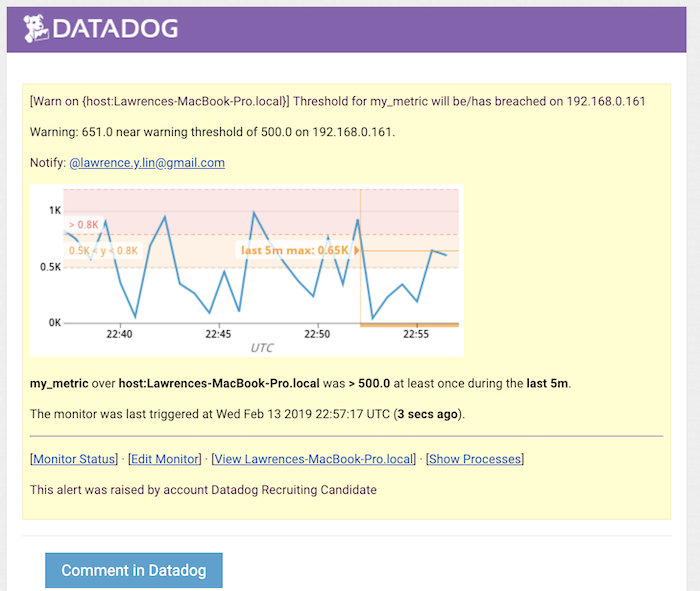
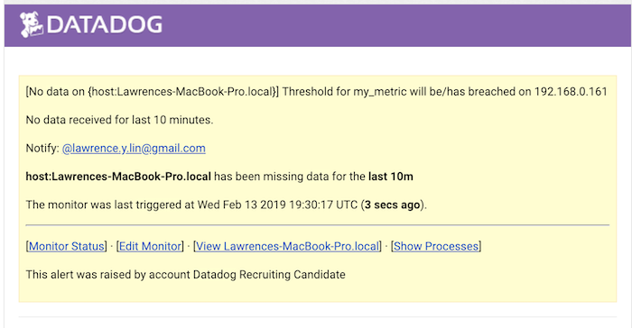
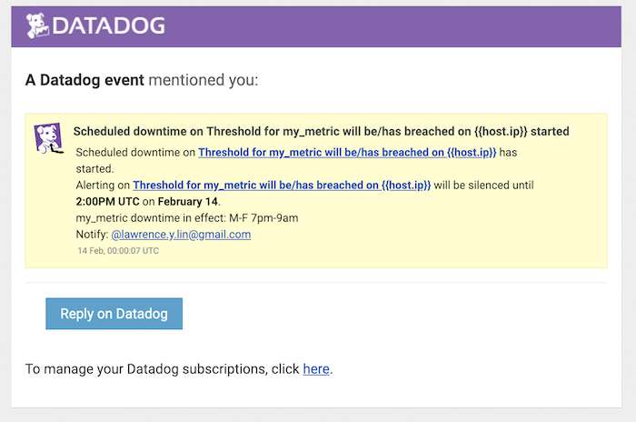
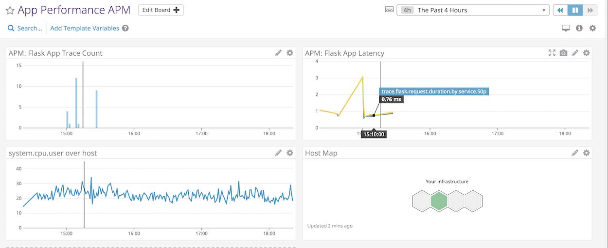

<ins>Part 1: Collecting Metrics Test</ins> 
1a: Screenshot of Host Map showing tags set via Agent Config file 
 
 
1b: Integrated PostgreSQL; screenshot of datadog-agent status 
 
1 Bonus: Not sure how to override the collection interval outside of modifying the yaml file, but you could set up a cron job and script to monitor a certain metric, send the data points to Datadog via API, and view/add a Dashboard. 
 
<ins>Part 2: Visualizing Data</ins> 
2a. I had trouble getting my script to create the 2nd requirement (integration metric with anomaly function applied).  I created a Timeboard manually with the required info,  requested all Timeboards via the API to get the id, and finally got that id's definition which returned:  
 
{"q":"anomalies(avg:postgresql.db.count{host:Lawrences-MacBook-Pro.local}, 'basic', 2)","style":{"palette":"dog_classic","width":"normal","type":"solid"} 
 
which is the same if I look at the JSON view of editor.  The response from the API with this request field was:   
 
{"errors": ["Error parsing query: unable to parse anomalies(avg:postgresql.db.count{host:Lawrences-MacBook-Pro.local}, basic, 2: Rule 'scope_expr' didn't match at ', 2' (line 1, column 75)."]} 
 
I tried shifting the order to match the details when you hover over the timeseries but that also didn't.  I also tried with the outliers function with no success, and am included what I used, but applying the cumsum function instead of anomalies. 
 
curl  -X POST -H "Content-type: application/json" -d '{
      "graphs" : [{
          "title": "Custom Metric Timetable via API",
          "definition": {
              "events": [],
              "requests": [
                  {"q": "avg:my_metric{host:Lawrences-MacBook-Pro.local}"},
                  {"q": "cumsum(avg:postgresql.db.count{host:Lawrences-MacBook-Pro.local})"},
                  {"q": "avg:my_metric{host:Lawrences-MacBook-Pro.local}.rollup(sum, 3600)","style":{"palette":"dog_classic","width":"normal","type":"solid"},"type":"bars"}
              ],
              "viz": "timeseries"
          }
      }],
      "title" : "Custom Metric Shell via API",
      "description" : "A dashboard with custom metric info utilizing Datadog API.",
      "template_variables": [{
          "name": "var",
          "prefix": "null",
          "default": "*"
      }],
      "read_only": "True"
}' "https://api.datadoghq.com/api/v1/dash?api_key=<API_KEY>&application_key=<APP.KEY>" 
 
2 Bonus: The anomaly function highlights any unexpected behavior based on past data and a standard deviation defined by the user. 
 
<ins>Part 3: Monitoring Data</ins> 
3a: Screenshots of Monitor Emails 

 
3 Bonus: Screenshot of Downtime Email 
 
 
<ins>Part 4: Collecting APM Data</ins> 
4a: Link to APM Dashboard: https://app.datadoghq.com/dashboard/q6b-u6u-y38/app-performance-apm?tile_size=m&page=0&is_auto=false&from_ts=1550096400000&to_ts=1550100000000&live=true 
4b: Screenshot of APM Dashboard 
 
4c: Fully instrumented app 
I used the Flask app that was provided in the prompt. 
4 Bonus: A service is a grouping of processes that do set of functions, an application.  A resource is each function for that service, often a specific request for a specific endpoint, like GET or POST request for a complete URL. 
 
<ins>Part 5: Final Question</ins> 
5a: Algo trading firm like to monitoring their networks/infrastructure/apps and metrics that could identify latency/connection issues are useful.  Otherwise, using the skyscanner API to find anomalous flight prices.
