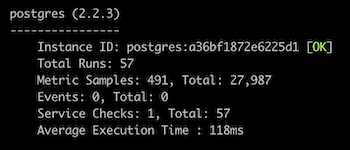

Part 1: Collecting Metrics 
1a: Screenshot of Host Map showing tags set via Agent Config file 

1b: Integrated PostgreSQL; screenshot of datadog-agent status 

 Bonus: Not sure how to override the collection interval outside of modifying the yaml file, but you could set up a cron job and script to monitor a certain metric, send the data points to Datadog via API, and view/add a Dashboard.

